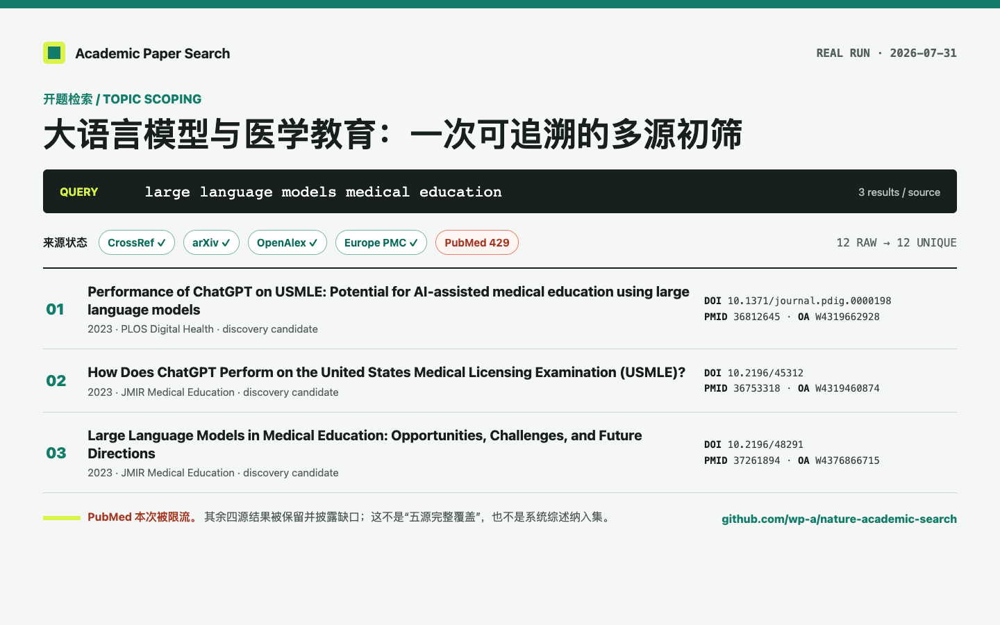

<div align="center">

# Academic Paper Search

**让 Codex / Claude Code 完成可复现的文献检索、核验与引用导出，并构建多源引文图谱。**

从一篇种子论文出发，沿多源参考文献和被引用关系扩展研究范围；每条边都保留来源、方向和覆盖缺口，
适合开题追踪、综述扩展和 AI 生成引用的事实核验。

安装标识仍为 `nature-academic-search`，现有命令与配置无需迁移。

默认并行检索 CrossRef、PubMed、arXiv、OpenAlex 和 Europe PMC；需要时显式调用 Semantic Scholar
搜索或富化，并把 ClinicalTrials.gov 试验注册与论文严格分开。

[](https://github.com/wp-a/nature-academic-search/actions/workflows/ci.yml) [](https://pypi.org/project/nature-academic-search/) [](https://pypi.org/project/nature-academic-search/) [](LICENSE) [](https://github.com/wp-a/nature-academic-search/stargazers)

> **推荐配套服务 · [WPIRONMAN AI 中转](https://api.wpironman.top)**
>
> 为 Codex、Claude Code 和本项目 workflow 提供可选模型入口（OpenAI-compatible）。
> **[立即进入控制台](https://api.wpironman.top)** · 论文源仍由本项目直连，中转不是论文来源或数据库。

[真实案例](#三个可复制的中文场景) · [快速开始](#30-秒开始) · [数据源](#数据源如何分工) · [能力边界](#能力边界)

<a href="docs/examples/topic-scoping.md">
  
</a>

<sub>本次真实结果 · 2026-07-31：四个来源成功，PubMed 429 被明确披露；点击查看完整记录与边界。</sub>

第三方收录：[TensorBlock MCP Server Directory](https://tensorblock.co/mcp/servers/github-wp-a-nature-academic-search-24b4493d) · [合并记录](https://github.com/TensorBlock/awesome-mcp-servers/pull/1492)

</div>

## 直接这样问

安装后，在 Codex 或 Claude Code 中输入：

> 使用 `$nature-academic-search` 查找 2022 年以来 GLP-1 受体激动剂与抑郁风险的论文。
> 使用默认五个论文源，去重后核验 DOI / PMID / PMCID，区分正式论文和预印本；
> 对有强标识符的记录用 Semantic Scholar 补充引用指标，最后导出 RIS。某个来源失败时继续并说明。

查询试验注册时明确指定实体类型：

> 使用 `$nature-academic-search` 调用 `search_papers`，以 `entity_type="trial"` 查找正在招募的
> 肺癌新辅助免疫治疗试验；按 NCT ID 去重，不要把试验注册当成已发表论文。

返回结果会证明哪些来源实际执行，而不是只展示一张无法追溯的标题清单：

```yaml
query: "GLP-1 receptor agonists AND depression risk"
entity_type: publication
sources_queried: [crossref, pubmed, arxiv, openalex, europe_pmc]
sources_succeeded: [crossref, pubmed, arxiv, openalex, europe_pmc]
sources_skipped: []
errors: null
raw_result_count: <去重前数量>
result_count: <唯一记录数量>
results:
  - title: <题名>
    record_id: <稳定记录 ID>
    sources: [pubmed, europe_pmc]
    source_records: [<来源记录>]
    citation_counts: {openalex: <来源计数>, semantic_scholar: <来源计数>}
    citation_count_source: openalex
```

## 证据级输出

`search_papers` 的返回值不仅是题名列表，还包含可保存的检索运行记录：

```yaml
search_run:
  schema_version: "1"
  run_id: <UUID>
  started_at: <UTC 时间>
  completed_at: <UTC 时间>
  requested_sources: [crossref, pubmed, arxiv, openalex, europe_pmc]
  raw_result_count: <去重前数量>
  result_count: <唯一记录数量>
  result_fingerprint: sha256:<结果指纹>
```

建议把完整 JSON 响应保存为 `run.json`。`record_id` 让同一条记录可以跨次检索比较；
`sources`、`source_records` 和 `conflicts` 仍然是来源追踪的依据。

检索到不等于已经核验。对已有引用，调用 `get_paper_by_id` 时传入可选的 `expected`：

```json
{
  "title": "待核验题名",
  "authors": ["第一作者"],
  "year": 2024,
  "doi": "10.xxxx/example"
}
```

返回会做字段级比较，逐项检查题名、作者、年份、期刊和标识符，并给出 `verified`、`mismatch`、
`not_found` 或 `manual_needed`。不确定记录必须单独列出，不能为了生成一份漂亮的引用而
自动补全或静默覆盖冲突。

## 引文图谱：多源上下游检索

需要从一篇种子论文向前追溯参考文献、向后寻找 citing papers 时，在同一个
`get_paper_by_id` 调用中打开图谱，不需要记忆新的 MCP 工具名：

```json
{
  "id": "10.1038/s41586-020-2649-2",
  "include_relations": true,
  "relation": "both",
  "depth": 1,
  "rows": 20,
  "relation_sources": ["openalex", "crossref", "pubmed", "europe_pmc", "semantic_scholar"]
}
```

`relation` 可取 `references`（种子 → 被引用）、`cited_by`（引用者 → 种子）或 `both`。
默认只展开一跳；`depth=2` 必须显式请求，且始终受节点/边上限约束。返回值会在原论文记录上增加
`citation_graph`，包括：

- `nodes`：带稳定 `record_id` 的论文节点，跨源同一论文合并并保留 `source_records`；
- `edges`：统一为 citing → cited 的方向，附 `relation` 和 `observed_by` 来源列表；
- `sources_queried`、`sources_succeeded`、`sources_skipped`、`errors`：逐源披露实际覆盖；
- `truncated`、`truncation_reason`、`depth_completed`：说明是否触达预算边界。

OpenAlex 负责跨学科上下游，Crossref/Europe PMC 主要提供参考文献，PubMed 提供生物医学双向关系，
Semantic Scholar 可作为显式补充。某源没有 incoming 接口、缺少强标识符或被限流时，结果会记录缺口，
不会把“未查询到”误写成“没有引用”。引文关系只描述图结构，不代表证据质量、因果关系或研究结论。

在 YAML workflow 中显式加入 `expand_citations`，即可把同样的图谱写入 `graph.json`：

```yaml
steps: [plan, search, verify, expand_citations, export]
citation_graph:
  relation: both
  depth: 1
  rows: 10
  sources: [openalex, crossref, pubmed, europe_pmc]
```

## 智能发现：过滤与可复现排序

需要缩小范围时，给 `search_papers` 传入统一的 `filters`，不要把一个数据库的字段语法硬套到所有来源：

```json
{
  "date_from": "2022-01-01",
  "date_to": "2024-12-31",
  "language": "en",
  "author": "Jane Doe",
  "document_type": ["journal-article"],
  "identifiers": ["10.1000/example"]
}
```

日期使用 `YYYY-MM-DD`；语言使用 ISO 两位或三位代码。系统会把日期、作者和类型翻译为
CrossRef、PubMed、OpenAlex、Europe PMC 或 arXiv 能理解的查询参数，并对无法由源可靠表达的
字段执行本地过滤。未知字段、反向日期范围和空列表会直接报错，不会静默放宽条件。

传入 `ranking="relevance"`，或传入任一 `filters` 后不指定 ranking，会启用固定版本的本地排序。
每条记录会增加 `ranking_score` 与 `ranking_reasons`，`search_run.ranking` 会记录
`score_version`。这是检索相关性，不是证据质量、同行评议质量或引用真实性；需要审计时按
`record_id`、`result_fingerprint` 和排序版本保存完整 JSON。使用 `ranking="none"` 可保留过滤后的
来源顺序。

## 科研工作流自动化

把一次研究任务保存为 YAML，运行器会在检索前停在审批门，并把每一步写成可审计 artifact：

```yaml
workflow: literature-review
question: "生成式 AI 在医学教育中的应用与风险"
steps: [plan, search, verify, screen, export]
search:
  entity_type: publication
  sources: [crossref, pubmed, arxiv, openalex, europe_pmc]
  rows: 20
  filters: {date_from: "2020-01-01", language: zh}
outputs: [run.json, results.json, verification.json, screening.csv, references.ris, report.md]
```

```bash
nature-academic-search workflow run --file review.yml --output artifacts
nature-academic-search workflow run --file review.yml --output artifacts --approve
```

首次运行不带 `--approve` 只生成 `plan.json`，不会访问学术源。默认导出只包含 `verified` 记录；
`mismatch`、`not_found` 和 `manual_needed` 会留在核验 artifact 中。模型筛选失败时仍保留检索、
核验和导出，并把 screen 标记为 `skipped` / `pending_manual`。

### 可选的 WPIRONMAN 模型层

中转站只是计划或初筛的模型提供方，不是论文来源。配置环境变量后，运行器会使用普通 HTTP；不会
使用 Responses WebSocket，也不会把 key 写入 manifest、日志或 prompt artifact：

```bash
export ACADEMIC_SEARCH_LLM_BASE_URL=https://api.wpironman.top/v1
export ACADEMIC_SEARCH_LLM_API_KEY=你的中转密钥
export ACADEMIC_SEARCH_LLM_MODEL=你的模型名
export ACADEMIC_SEARCH_LLM_PROTOCOL=responses_http
```

默认只发送标题、摘要、标识符和批准的元数据；全文必须在 workflow 的 `privacy.allow_full_text`
中显式打开。网关不可用或返回坏 JSON 时最多重试一次，随后只跳过模型步骤。

## 三个可复制的中文场景

### 开题检索

```text
使用 $nature-academic-search 为“生成式 AI 在医学教育中的应用与风险”做开题检索。
先记录检索日期和纳入范围，再使用默认论文源检索；按 DOI、PMID、PMCID、arXiv
和 OpenAlex ID 去重。把正式论文、预印本和未解决记录分开，逐源报告成功、失败与
限流状态。不要把本次初筛描述成系统综述，也不要根据引用次数判断证据质量。
```

[查看 2026-07-31 实测记录](docs/examples/topic-scoping.md)

### AI 幻觉引用核验

```text
使用 $nature-academic-search 核验下面的参考文献。先从 DOI / PMID / PMCID / arXiv ID
取回原始元数据，再逐项比较题名、作者、年份和期刊。输出 verified、mismatch、
not_found 或 manual_needed，并解释冲突；不要用搜索结果自动补成一条看似完整的引用。

待核验引用：在这里粘贴引用
```

[查看 DOI 与题名冲突实测](docs/examples/citation-verification.md)

### PubMed / MeSH 检索

> `lookup_mesh` 的 ESummary 解析修复目前位于 `main`。PyPI `0.2.0` 与插件固定版本尚未包含该修复；要复现下面的 MeSH 案例，请先从当前源码安装：

```bash
git clone https://github.com/wp-a/nature-academic-search.git
cd nature-academic-search
bash install.sh --client both --email researcher@example.com
```

```text
使用 $nature-academic-search 为“生成式 AI 与医学教育”构建 PubMed 起始检索式。
先分别调用 lookup_mesh 核对 Artificial Intelligence、Generative Artificial Intelligence
和 Education, Medical 的规范主题词与 MeSH ID；再把 MeSH 与题名/摘要自由词分组组合。
输出每个主题词的核验结果、最终检索式和仍需人工调整的边界，不要把关键词直接猜成 MeSH。
```

[查看 NCBI MeSH 实测记录](docs/examples/pubmed-mesh.md)

## 30 秒开始

### Codex 插件

```bash
codex plugin marketplace add wp-a/nature-academic-search
codex plugin add nature-academic-search@wp-a-academic-tools
```

### Claude Code 插件

```bash
claude plugin marketplace add wp-a/nature-academic-search
claude plugin install nature-academic-search@wp-a-academic-tools
```

### CLI 与自动安装器

```bash
uv tool install nature-academic-search
export PUBMED_EMAIL=researcher@example.com
nature-academic-search install --client both --email researcher@example.com
nature-academic-search preflight
```

也可使用 `pipx install nature-academic-search`。从仓库安装并保留旧命令兼容：

```bash
bash install.sh researcher@example.com
```

`NCBI_API_KEY`、`OPENALEX_API_KEY`、`SEMANTIC_SCHOLAR_API_KEY` 均为可选项。没有 Semantic Scholar
key 时预检会标记 `SKIP`，不会回显任何凭据。完整说明见[安装文档](docs/installation.md)。

> [!IMPORTANT]
> **安装后下一步：配置可选模型入口**
>
> 如果要启用 workflow 的计划或筛选辅助，可配置 WPIRONMAN AI 中转；不配置也能完成论文检索、核验和导出。
> [进入 WPIRONMAN 控制台 →](https://api.wpironman.top)

## 数据源如何分工

| 来源 | 调用方式 | 最适合做什么 | 边界 |
|---|---|---|---|
| CrossRef | 默认论文源；图谱 references | DOI、出版商元数据、格式化引用、出版商参考文献 | 没有统一 incoming 引用接口 |
| PubMed | 默认论文源；图谱双向 | 生物医学索引、PMID、MeSH、ELink 上下游 | 不保证全文可得；受 NCBI 速率限制 |
| arXiv | 默认论文源 | 预印本与版本线索 | 不代表同行评审状态 |
| OpenAlex | 默认论文源 | 跨学科发现、OA 与来源化引用指标 | 指标只代表 OpenAlex 口径 |
| Europe PMC | 默认论文源；图谱 references | PMID/PMCID、生物医学与开放全文线索、参考文献 | 主要提供 outgoing references，与 PubMed 有重叠 |
| Semantic Scholar | 显式搜索、`enrich` 或图谱 | 补充元数据、引用和参考文献关系 | 需显式选择；受 API 配额影响 |
| ClinicalTrials.gov | `entity_type="trial"` | NCT 注册、状态、干预、申办方和入组信息 | 试验注册不是论文 |

默认 publication 搜索调用前五源。显式传入旧三源列表时仍只调用 CrossRef、PubMed、arXiv，兼容旧工作流。

## 它如何工作

**检索 → 过滤/排序 → 去重 → 核验 → 导出**

不启用智能发现时，兼容的基础流程仍是：**检索 → 去重 → 核验 → 导出**。

1. **定义范围**：记录研究主题、日期、类型、数量、是否接受预印本以及实体类型。
2. **按库检索**：使用各来源适合的查询，不把 PubMed 字段语法复制到其他 API。
3. **过滤排序**：统一 filters 先转为源查询；本地兜底后按固定 score version 排序并记录理由。
4. **合并去重**：优先匹配 DOI、PMID、PMCID、arXiv、OpenAlex、Semantic Scholar 或 NCT ID；
   弱题名匹配只在相同实体类型内进行。
5. **保留溯源**：每条记录带 `sources` / `source_records`；冲突进入 `conflicts`。
6. **逐条核验**：对照题名、作者、期刊、年份和标识符，标记 `verified`、`mismatch`、
   `not_found` 或 `manual_needed`。
7. **分类交付**：正式论文、预印本、trial 和未解决记录分开；论文可导出 RIS、BibTeX、NBIB 或 ENW。

任一来源超时或失败时，其他成功结果仍会保留。`sources_queried`、`sources_succeeded`、
`sources_skipped` 与 `errors` 明确展示完整状态。

## 为什么是“核验优先”

| 常见检索输出 | Academic Paper Search |
|---|---|
| 只给标题和链接 | 保留查询、日期、实体类型、标识符与来源追踪 |
| 多库结果重复 | 强标识符优先去重，弱匹配保留冲突 |
| 引用次数混成一个数字 | 使用 `citation_counts` 和 `citation_count_source` 标明口径 |
| 预印本、论文和试验注册混在一起 | 按 publication/preprint/trial 分组且禁止跨实体合并 |
| 单库故障导致整次失败 | 返回部分成功结果并披露失败或跳过原因 |
| 引用格式靠模型补全 | 解析记录后格式化；NCT 不伪造论文引用 |

## 适合的科研任务

- **选题调研**：“找近五年肿瘤免疫治疗耐药机制论文，按正式论文和预印本分组。”
- **MeSH 策略**：“核验生成式 AI 与医学教育的 MeSH，再构建 PubMed 检索式。”
- **引用核验**：“检查这些 DOI / PMID / PMCID 是否对应给定题名，逐项报告冲突。”
- **版本追踪**：“判断这些 arXiv 预印本是否已有正式发表版本。”
- **试验追踪**：“查 ClinicalTrials.gov 招募中试验，并另行核验其 linked publications。”
- **文献导出**：“把已核验论文去重后导出 RIS，同时单列未解决引用。”

它适合综述前期检索、证据地图和引用整理，但不会替代正式系统综述所需的订阅数据库、双人筛选、
偏倚评估或学科馆员复核。

## MCP 工具

四个工具名保持稳定；客户端可能添加 MCP 命名空间前缀。

| Tool | 用途 |
|---|---|
| `search_papers` | 搜索 publication 或 trial，按统一 filters 过滤、可复现排序、合并记录并返回来源状态 |
| `get_paper_by_id` | 解析 DOI、PMID、PMCID、arXiv、OpenAlex、Semantic Scholar URL 或 NCT ID |
| `get_citation` | 格式化已解析论文；trial 返回结构化边界错误 |
| `lookup_mesh` | 查询 PubMed MeSH 描述词 |

## CLI

```bash
nature-academic-search --help
nature-academic-search serve
nature-academic-search preflight
nature-academic-search citation --pmid 28344011 --format ris
nature-academic-search citation --input refs.txt --format bib --output references/
```

## 能力边界

- 本项目未连接 Google Scholar、Web of Science、Scopus、Embase、CNKI、万方，不会声称覆盖这些来源。
- 当前以元数据、标识符、引用和检索策略为核心，不承诺自动获得付费全文。
- 上游 API 会限流、超时或暂时不可用；预检和搜索结果会逐源披露。
- 不同来源的引用次数口径不同，不会相加成“全网总引用数”。
- 引用进入正式稿件前仍应由作者核对原文、出版社页面和期刊要求。

## 开发与维护

```bash
python -m pip install -e ".[test]"
python scripts/sync_skill.py --check
python -m ruff check src tests
python -m pytest
python -m pytest mcp-server/tests
python -m build
twine check dist/*
```

项目支持 Python 3.10–3.13。发布与依赖维护流程见[维护手册](docs/maintenance.md)。

## 参与项目

发现解析、来源冲突或安装问题时，请提交 [Issue](https://github.com/wp-a/nature-academic-search/issues)。
贡献代码前请保留四个 MCP 工具名、实体边界与结果契约，并添加回归测试。

如果这个项目能让你的文献检索更可追溯，欢迎点一个
[Star](https://github.com/wp-a/nature-academic-search)；它会帮助更多中文科研用户找到这套工作流。

## License

[MIT](LICENSE)
