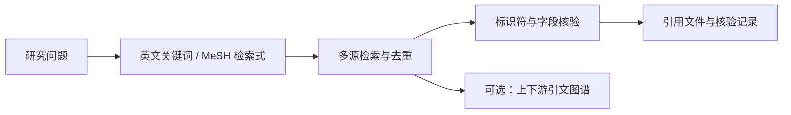

# Academic Paper Search

**给 Codex、Claude Code 和 DeepSeek Harness 使用的文献检索与引用核验工具。**

用中文描述研究问题，跨学术数据库找论文、去重、核对引用，导出文献管理器可用的文件。

[](https://github.com/wp-a/nature-academic-search/actions/workflows/ci.yml) [](https://pypi.org/project/nature-academic-search/) [](https://pypi.org/project/nature-academic-search/) [](LICENSE) [](https://github.com/wp-a/nature-academic-search/stargazers)

[快速开始](#30-秒开始) · [中文场景](#六个可复制的中文场景) · [工具与命令](#工具与命令) · [批量工作流](#批量工作流) · [数据源](#数据源如何分工) · [常见问题](#常见问题)

> **可选配套服务：[WPIRONMAN AI 中转](https://api.wpironman.top)**
> 提供可选模型入口，不是论文来源。学术源检索、元数据核验和引用下载不需要配置中转。

## 这是什么

本项目帮助科研用户完成**可复现的文献检索、核验与引用导出**。核心流程是
**检索 → 去重 → 核验 → 导出**；需要扩展阅读时，可以从种子论文追踪参考文献和后续引用。

安装标识仍为 `nature-academic-search`，展示名称为 **Academic Paper Search**。
名称中的 `nature` 不限制检索范围，也不表示与 Nature Portfolio 有官方关联。

| 组成 | 做什么 | 什么时候需要 |
|---|---|---|
| **Skill** | 指导 AI 拆解问题、选数据库、核对字段、报告来源与缺口 | 希望直接用自然语言安排检索任务 |
| **MCP 服务** | 提供 4 个工具，实际查询学术 API、解析标识符、生成引用、查 MeSH | 让 Codex、Claude Code 等客户端调用工具 |
| **CLI** | 在终端运行连通性检查、引用下载、YAML 工作流；源码版另有 `search` / `verify` | 批量任务、脚本调用和本地调试 |

默认论文源为 **CrossRef、PubMed、arXiv、OpenAlex、Europe PMC**；
Semantic Scholar 按需启用，ClinicalTrials.gov 单独用于试验注册检索。



你会得到带来源的候选论文、字段级核验结果、可导入 Zotero / EndNote 的引用文件，
以及查询参数、时间、失败来源等审计信息。保存这些记录可以复查一次检索；上游数据持续更新，
同一检索式日后重跑不保证返回完全相同的结果。

## 30 秒开始

以下面向已装好客户端和 Python 工具的用户；首次安装依赖、下载运行环境可能需要更久。

### 1. 准备环境

- **Python 3.10+**，以及 [uv](https://docs.astral.sh/uv/getting-started/installation/)（插件通过 `uvx` 启动服务）。
- Codex 或 Claude Code；选择自己实际使用的客户端即可。
- 一个用于 PubMed 请求的联系邮箱。把示例邮箱替换成自己的地址，并让启动客户端的环境能读取它：

```bash
export PUBMED_EMAIL=researcher@example.com
```

下列终端示例使用 Bash / Zsh 语法。桌面客户端未必继承终端里的 `export`，见[常见问题](#常见问题)。

### 2. 安装插件，二选一

**Codex：**

```bash
codex plugin marketplace add wp-a/nature-academic-search
codex plugin add nature-academic-search@wp-a-academic-tools
```

**Claude Code：**

```bash
claude plugin marketplace add wp-a/nature-academic-search
claude plugin install nature-academic-search@wp-a-academic-tools
```

插件同时提供 Skill 和 MCP 配置。安装后开启新会话，让客户端加载工具。
Codex 的市场命令见[官方说明](https://learn.chatgpt.com/docs/developer-commands#codex-plugin-marketplace)；
若本机没有 `plugin` 子命令，可使用下方的 Python 包安装方式。

### 3. 检查连接，发起第一次请求

```bash
uvx --from nature-academic-search==0.3.1 nature-academic-search preflight
```

检查报告中的 `OK`、`FAIL`、`SKIP`，再复制下一节的请求到客户端。
`preflight` 检查学术 API 的连通性，不代表客户端已加载 MCP；也不保证每次检索都成功。

<details>
<summary><strong>其他安装方式：Python 包、源码版、DeepSeek Harness</strong></summary>

**Python 包 / 手动注册 MCP**

```bash
uv tool install nature-academic-search
# 也可用 pipx install nature-academic-search

# 先预览，再注册自己使用的客户端
nature-academic-search install --client codex --email researcher@example.com --dry-run
nature-academic-search install --client codex --email researcher@example.com
nature-academic-search preflight
```

`--client` 可选 `codex`、`claude`、`both`；仅当两者都已安装时使用 `both`。
安装器复制 Skill，并通过客户端 CLI 注册 MCP；会更新所选客户端中已有的同名注册。
已经通过插件安装的用户通常无需再重复注册。只用终端时，跳过 `install --client` 即可。

**源码版：使用本次 `0.3.1` 修复与 `search` / `verify` 命令**

```bash
git clone https://github.com/wp-a/nature-academic-search.git
cd nature-academic-search
uv tool install --force .
nature-academic-search --help
```

也可从仓库一次完成源码安装和客户端注册，按需将 `both` 改为 `codex` 或 `claude`：

```bash
bash install.sh --client both --email researcher@example.com
# 兼容旧用法：bash install.sh researcher@example.com
```

**版本说明：** `0.3.1` 包含 CLI `search` / `verify`、自动 workflow 核验和筛选导出修复，
包版本和本仓库插件配置统一为 `0.3.1`。旧 PyPI `0.3.0` 不包含这两个 CLI 命令，
也没有本次 workflow 修复。升级 CLI 可运行 `uv tool upgrade nature-academic-search`；
插件用户还需更新插件并开启新会话，仅升级 CLI 不会改变已安装插件的固定运行时。

**DeepSeek Harness**

使用独立的 [`dsh-academic-paper-search` Bundle](https://github.com/wp-a/dsh-academic-paper-search)。
它桥接同一套 Python MCP 服务，工具显示为 `mcp__academic_search__*`。
安装要求、发布状态和配置步骤以该仓库为准。

更多配置见[安装文档](docs/installation.md)。

</details>

> [!IMPORTANT]
> **安装后下一步：配置可选模型入口**
>
> 如果要启用 workflow 的计划或筛选辅助，请先阅读[模型层说明](#wpironman-ai-中转可选模型层)：
> 当前 runner 自动调用模型的是 `screen` 步骤，`plan.json` 由本地配置生成。
> [进入 WPIRONMAN 控制台 →](https://api.wpironman.top)。不配置中转也能使用学术检索工具。

## 直接这样问

在 Codex 中可使用 `$nature-academic-search` 显式指定技能；也可在各客户端直接说明技能名称和任务：

```text
使用 nature-academic-search，为“生成式 AI 在医学教育中的应用与风险”找文献。
先把中文问题拆成英文关键词；生物医学概念先核对 MeSH。
使用默认五个论文源，每源先取 5 条，去重后给出候选清单和各来源的成功、失败情况。
从候选中选 3 条，用原始标识符重新查询，并以候选的题名、作者、年份为 expected 做核验。
分别列出已核验、存在冲突和需要人工检查的记录，附 DOI / PMID 与来源链接。
```

判断是否跑通：客户端实际调用了工具，返回来源状态，并给出字段核验结果。
只收到模型生成的题名列表，还不能算完成核验。

## 六个可复制的中文场景

前三个可复制的中文场景附有历史实测截图。**本次真实结果记录日期为 2026-07-31**，
版本、输入和失败来源见各案例；它们展示结果格式，不代表今天的实时命中数。

<table>
  <tr>
    <td align="center" width="33%">
      <a href="docs/examples/topic-scoping.md"></a><br>
      <a href="docs/examples/topic-scoping.md">开题检索</a>
    </td>
    <td align="center" width="33%">
      <a href="docs/examples/citation-verification.md"></a><br>
      <a href="docs/examples/citation-verification.md">引用核验</a>
    </td>
    <td align="center" width="33%">
      <a href="docs/examples/pubmed-mesh.md"></a><br>
      <a href="docs/examples/pubmed-mesh.md">PubMed / MeSH</a>
    </td>
  </tr>
</table>

### 1. 开题检索

```text
使用 nature-academic-search 检索“生成式 AI 在医学教育中的应用与风险”。
先给出英文检索式，再用默认论文源搜索；按强标识符去重。
整理 10 条候选线索，注明年份、文献类型、来源、DOI / PMID 和待核验项；
报告实际检索日期及失败来源，区分预印本与正式发表记录。
```

得到：可继续筛选的候选清单、检索范围和来源缺口。[查看案例](docs/examples/topic-scoping.md)

### 2. AI 幻觉引用核验

下面故意给一条 DOI 存在、其他字段错误的引用，用于演示冲突检测：

```text
使用 nature-academic-search 核验：
Smith et al. (2024). Large language models for clinical diagnosis. Nature.
DOI: 10.1038/nature14539
将题名、首位作者、年份和期刊作为 expected，逐项比较真实元数据；
保留冲突及来源链接，不要因为 DOI 可解析就判定引用正确。
```

该 DOI 对应 *Deep learning*（2015）；示例应出现 `mismatch`。[查看完整核验记录](docs/examples/citation-verification.md)

### 3. PubMed / MeSH 检索

```text
使用 nature-academic-search 为“生成式 AI 与医学教育”设计 PubMed 起始检索式。
先用 lookup_mesh 核对 Artificial Intelligence、Generative Artificial Intelligence、
Education, Medical 的规范主题词和 MeSH ID，再组合 MeSH 与题名/摘要自由词。
输出核词结果、最终检索式和仍需补充的同义词；PubMed 专用语法只用于 PubMed。
```

得到：核验过的主题词和可继续调整的检索式。[查看案例](docs/examples/pubmed-mesh.md)

### 4. 上下游引文追踪

```text
使用 nature-academic-search 解析 DOI 10.1038/nature14539。
调用 get_paper_by_id，设置 include_relations=true、relation=both、depth=1、rows=10。
分别解释它引用了哪些论文、哪些论文引用了它，保留每条边的 observed_by；
报告失败来源、缺少的关系方向和截断原因，将 citation_graph 保存为 graph.json。
```

得到：结构化 `nodes` / `edges`。`references` 指“它引用了谁”，`cited_by` 指“谁引用了它”；
边始终采用 **citing → cited** 方向。工具返回 JSON，图形展示需要客户端或其他可视化工具另行生成。

### 5. 综述整理

```text
使用 nature-academic-search，为“数字疗法对抑郁症的随机对照试验”拟定检索计划。
记录检索式、数据库、日期、纳入排除标准，等我确认后再检索。
对候选逐条调用 get_paper_by_id 并传 expected 核验，只将 verified 记录导出为 RIS；
把冲突、未找到和人工待处理记录单独列出。初筛建议不代表最终纳入决定。
若使用 CLI workflow，需要筛选时启用 screen；无需模型初筛时省略 screen，直接导出核验通过记录。
```

得到：计划、候选集、核验清单和引用文件。CLI 的具体行为见[批量工作流](#批量工作流)。

### 6. 临床试验关联

```text
使用 nature-academic-search，以英文关键词检索肺癌新辅助免疫治疗相关试验。
调用 search_papers(entity_type="trial")，按 NCT ID 整理试验状态、干预和申办方，
再根据返回状态标出正在招募的记录。若包含 linked publications，单独核验其 PMID / DOI；
试验注册和已发表论文分开列出，不把注册状态当作疗效结果。
```

得到：ClinicalTrials.gov 注册记录，以及需要另行解析的关联论文线索。

## 工具与命令

### 四个 MCP 工具

客户端可能添加工具名前缀。以下为服务端名称：

| 工具 | 用途 | 关键参数 |
|---|---|---|
| `search_papers` | 多源检索、去重、过滤与相关性排序 | `query`、`sources`、`rows`、`filters`、`ranking`、`entity_type`、`enrich` |
| `get_paper_by_id` | 解析标识符；可选字段核验和引文图谱 | `id`、`id_type`、`expected`、`include_relations`、`relation`、`depth`、`relation_sources` |
| `get_citation` | 生成单条格式化引用 | `id`、`id_type`、`style`，如 `apa`、`nature`、`vancouver` |
| `lookup_mesh` | 查询 MeSH 规范主题词 | `term` |

支持 DOI、PMID、PMCID、arXiv、OpenAlex、Semantic Scholar 和 NCT 等标识符；
原始 Semantic Scholar ID 应显式指定 `id_type="semantic_scholar"`。
NCT 用于试验查询，不生成论文引用。图谱通过 `get_paper_by_id` 返回，不需要额外安装工具。

<details>
<summary><strong>MCP 参数示例：日期过滤、字段核验、引文图谱</strong></summary>

以下是传给相应 MCP 工具的 JSON 参数，不是终端命令。

**按日期检索并排序 — `search_papers`：**

```json
{
  "query": "generative AI medical education",
  "sources": ["crossref", "pubmed", "europe_pmc"],
  "rows": 5,
  "filters": {"date_from": "2022-01-01", "date_to": "2026-09-09"},
  "ranking": "relevance"
}
```

`rows` 是**每个来源**的返回上限，检索范围为 1–50；去重、过滤后的总数可能更少。
省略 `sources` 使用默认五源，显式指定时只查询所选来源。
`filters` 还支持 `language`、`author`、`document_type`、`identifiers`；缺失必要字段的记录可能被过滤掉。
相关性排序是本地规则评分，会写入 `ranking_score`、`ranking_reasons` 和 `score_version`。

**核对真实引用 — `get_paper_by_id`：**

```json
{
  "id": "10.1038/nature14539",
  "expected": {"title": "Deep learning", "year": 2015, "journal": "Nature"}
}
```

只提供 `id` 时是元数据查询；提供 `expected` 才增加 `verification`。
只核对传入的字段，不能把“题名匹配”表述为“整条引用已全部核验”。

**获取一跳关系 — `get_paper_by_id`：**

```json
{
  "id": "10.1038/nature14539",
  "include_relations": true,
  "relation": "both",
  "depth": 1,
  "rows": 10,
  "relation_sources": ["openalex", "crossref", "pubmed", "europe_pmc"]
}
```

图谱的 `rows` 是每个来源、每个方向的邻居上限（1–100）；`depth` 支持 1 或 2。
还受节点和边预算限制，判断是否完整请检查 `truncated`、`truncation_reason`、`depth_completed`。

</details>

### CLI 示例

**发布版可用：**

```bash
nature-academic-search --help
nature-academic-search preflight
nature-academic-search citation --pmid 28344011 --format ris --output references/
nature-academic-search citation --input refs.txt --format bib --output references/
```

`refs.txt` 每行使用带类型前缀的标识符，例如：

```text
DOI:10.1038/nature14539
PMID:28344011
ARXIV:1706.03762
```

没有类型前缀的行会被当作 PubMed 自由文本查询，而非标识符直接解析。
`citation --output` 指定的是**目录**，批量命令会生成各条记录的引用文件。
支持 `nbib`、`ris`、`bib`、`enw`；下载或格式转换不会自动对你原先的引用做 `expected` 核验。
给其他 MCP 客户端接入时，启动命令为 `nature-academic-search-mcp`，也可用 `nature-academic-search serve`（stdio）。

**`0.3.1` 源码版及后续发布包：**

```bash
nature-academic-search search "generative AI medical education" \
  --sources crossref,pubmed --rows 5 > search-results.json

nature-academic-search verify 10.1038/nature14539 \
  --expected-title "Deep learning" --expected-year 2015 --expected-journal "Nature" \
  > verification.json

nature-academic-search search "lung cancer neoadjuvant immunotherapy" \
  --entity-type trial --rows 5 > trials.json
```

CLI `search` 默认 `--ranking relevance`。日期等 `filters` 和引文图谱参数目前通过 MCP / workflow 配置，
没有对应的 `search --filters` 或 `verify --include-relations` 选项。
脚本调用后仍需检查 JSON 中的 `errors` 和 `verification.status`，退出码为 0 不代表所有来源成功或引用匹配。

## 批量工作流

YAML workflow 保存检索配置、生成计划，并按候选的强标识符重新查询元数据、逐字段核验。
**从 `0.3.1` 起，CLI 自动执行回查核验**；缺少标识符、字段不足或来源失败时仍保留人工待处理状态。
默认只导出 `verified` 论文；启用 `screen` 时还必须获得明确的 `include` 决定。
核验范围记录在 `fields`、`lookup_id` / `lookup_id_type`。来源未提供的附加 ID 列入
`unchecked_identifiers`，保留在原始结果中；RIS 只写入已匹配的 DOI / PMID。
搜索列表末尾的 `et al.` 视为作者截断提示，不当作作者比较或导出。

将以下内容保存为 `review.yml`。`question` 会直接作为搜索查询，因此先使用英文关键词；
runner 不会自动把中文问题翻译成数据库检索式。

```yaml
workflow: medical-education-scoping
question: "generative AI medical education"
steps: [plan, search, verify, export]
search:
  entity_type: publication
  sources: [crossref, pubmed, europe_pmc]
  rows: 5
  filters:
    date_from: "2022-01-01"
    date_to: "2026-09-09"
  ranking: relevance
verification:
  include_statuses: [verified]
privacy:
  allow_full_text: false
```

这是不需要模型的检索、核验、导出流程。需要摘要级初筛时，在 `steps` 中加入 `screen`：
`[plan, search, verify, screen, export]`，并配置下方的可选模型层。

```bash
# 先生成 plan.json，查看检索范围
nature-academic-search workflow run --file review.yml --output artifacts/review-01

# 确认配置后重新执行，加 --approve 才开始查询学术源
nature-academic-search workflow run --file review.yml --output artifacts/review-01 --approve
```

| 文件 | 内容与用途 |
|---|---|
| `plan.json` | 从 YAML 生成的计划；未批准时只生成此文件 |
| `results.json` | 检索结果、来源状态、错误与 `search_run` |
| `verification.json` | 每条候选按标识符回查后的字段核验状态 |
| `screening.csv` | 初筛建议；未配置模型时为 `pending_manual` |
| `references.ris` | 按核验白名单选择论文；有 `screen` 时还需筛选为 `include` |
| `report.md` / `run.json` | 汇总说明、实际导出数 `exported_count`、运行时间、产物列表、步骤状态与错误 |
| `graph.json` | 可选；在 `steps` 中加入 `expand_citations` 后生成 |

每次独立运行使用新输出目录，避免覆盖上次文件。有 `screen` 时，`exclude`、`pending_manual`、
缺失或无效的筛选决定均不进入 RIS；模型未配置或失败时，记录保留在审计文件中等待人工处理。
`screening.csv` 是本次筛选输出，手动修改它不会在重跑时自动导入。省略 `screen` 则只应用核验白名单。
试验注册保留在 JSON 中，不作为论文导出到 RIS。模型筛选仍需人工复核。
`completed` / `completed_with_skips` 是流程状态，仍需查看 `results.json` 的来源错误和实际产物。

## 如何读懂结果

### 检索结果

| 字段 | 如何理解 |
|---|---|
| `sources_queried` / `sources_succeeded` | 实际尝试的来源 / 成功响应的来源；成功也可能返回 0 条 |
| `sources_skipped` / `errors` | 跳过的操作及原因 / 请求失败详情；未选择的来源不一定出现在 skipped 中 |
| `raw_result_count` / `result_count` | 本次取回的原始记录数 / 去重、过滤后的交付数；不是完整文献库规模 |
| `record_id` | 记录的稳定标识，优先由 DOI、PMID 等强标识符构造 |
| `sources` / `source_records` / `conflicts` | 合并记录的来源、逐源记录和字段冲突 |
| `search_run` | 查询、UTC 时间、范围、来源状态、过滤与排序信息 |
| `result_fingerprint` | 基于记录 ID 的结果集合指纹；不能替代原始 JSON 存档 |

保存完整响应，尤其是 `search_run` 和 `errors`。多源失败时仍可能返回部分记录；
“拿到了结果”与“五个源全部成功”是两种情况。

### 引用核验

| `verification.status` | 表示什么 | 下一步 |
|---|---|---|
| `verified` | 本次提供的 `expected` 字段与解析元数据匹配 | 保留核验字段与来源；引用科学结论前还需读原文 |
| `mismatch` | 至少一个字段不一致 | 查看 `fields` 中的预期值和实际值，检查错引或版本差异 |
| `not_found` | 标识符查询明确报告未找到记录 | 检查标识符、原始出处和其他来源 |
| `manual_needed` | 缺少字段、字段不可核对，或流程尚需人工处理 | 补充信息并人工复查 |

网络失败可能直接返回 `error`，不能解释成论文不存在。
核验比较的是书目信息，不判断研究质量，也不证明论文支持某句话。

## 数据源如何分工

| 来源 | 代码中的名称 | 启用方式 | 主要用途与关系覆盖 |
|---|---|---|---|
| CrossRef | `crossref` | 默认论文源 | DOI、出版元数据、引用格式；提供 `references` |
| PubMed | `pubmed` | 默认论文源 | 生物医学、PMID、MeSH；ELink 提供可用的双向引用关系 |
| arXiv | `arxiv` | 默认论文源 | 预印本及版本线索；当前不提供引用边 |
| OpenAlex | `openalex` | 默认论文源 | 跨学科发现、开放获取信息；`references` / `cited_by` |
| Europe PMC | `europe_pmc` | 默认论文源 | PMID / PMCID、生物医学记录；当前适配器提供 `references` |
| Semantic Scholar | `semantic_scholar` | 显式搜索、`enrich` 或图谱 | 补充元数据、来源化引用计数和双向关系 |
| ClinicalTrials.gov | `clinicaltrials_gov` | `entity_type="trial"` | NCT、招募状态、干预、申办方及关联论文线索 |

**未连接 Google Scholar、Web of Science、Scopus、Embase、CNKI、万方。**
数据库收录范围及关系覆盖不同；缺少接口或没有返回引用边，不表示该论文从未被引用。
不同来源的 `citation_counts` 不相加为“全网引用数”。

### 环境变量

| 变量 | 用途 |
|---|---|
| `PUBMED_EMAIL` | PubMed 联系邮箱；客户端安装器要求提供 |
| `NCBI_API_KEY` | 可选 NCBI 凭据 |
| `CROSSREF_MAILTO` | 可选 CrossRef 联系邮箱 |
| `OPENALEX_API_KEY` | OpenAlex 凭据；可用权限和配额以上游要求为准 |
| `SEMANTIC_SCHOLAR_API_KEY` | Semantic Scholar 凭据；未配置时其 credentialed preflight 检查会跳过 |
| `NATURE_ACADEMIC_SEARCH_CONFIG` | 可选 TOML 配置文件路径 |

本项目从进程环境和可选 TOML 读取配置，不会自动加载 `.env` 文件。
源 API 的密钥与下方的模型密钥用途不同；密钥不要写入仓库或检索结果。

## WPIRONMAN AI 中转：可选模型层

[WPIRONMAN AI 中转](https://api.wpironman.top) 为模型请求提供 OpenAI-compatible HTTP 入口。
当前 workflow runner 用它执行摘要级 `screen` 辅助；`plan.json` 由 YAML 本地生成，
研究问题和计划也可先在客户端与 AI 讨论，再写入配置。

```bash
export ACADEMIC_SEARCH_LLM_BASE_URL=https://api.wpironman.top/v1
export ACADEMIC_SEARCH_LLM_API_KEY=your-relay-key
export ACADEMIC_SEARCH_LLM_MODEL=your-model
export ACADEMIC_SEARCH_LLM_PROTOCOL=responses_http
```

将占位值替换成自己的配置。`responses_http` 使用普通 HTTP，不要求 WebSocket；
也支持 `chat_completions`。这些变量配置的是本项目 runner，不会替你修改客户端的模型设置。

默认发送标题、摘要、标识符等允许的元数据；只有设置 `privacy.allow_full_text: true` 才允许附带全文。
未配置模型或模型请求失败时，筛选步骤会跳过并保留人工待处理项，学术源检索仍可继续。

中转不提供 Crossref、PubMed 或其他论文数据库覆盖，不负责 DOI 真实性、字段核验或研究质量判断。

## 常见问题

| 现象 | 检查与处理 |
|---|---|
| `uvx` / `nature-academic-search` 找不到 | 确认 uv 或 Python 工具已安装，且客户端启动环境的 `PATH` 包含相应命令；重开终端或客户端 |
| 安装后看不到工具 | 开启新会话，检查插件是否启用、MCP 是否启动；手动注册方式可用 `codex mcp get nature-academic-search --json` 或 `claude mcp get nature-academic-search` 检查配置 |
| 已 `export` 邮箱，桌面端仍读不到 | 终端环境不一定传给桌面进程；可使用 `install --client codex/claude --email ...` 注册带邮箱的本地 MCP，注意避免与插件重复启用 |
| `search` / `verify` 提示无效命令 | PyPI `0.3.0` 尚未包含这两个子命令；安装当前源码，或通过客户端调用同名用途的 MCP 工具 |
| 部分来源超时、429 或鉴权失败 | 查看 `preflight` 和返回的 `errors`；检查网络、来源凭据与配额，降低 `rows`，稍后只重试失败来源 |
| 中文查询结果少或不相关 | 先把问题转成英文关键词，生物医学任务先核对 MeSH；本地相关性排序不负责翻译 |
| workflow 已完成，但 RIS 是空的 | 查看 `verification.json`、`screening.csv` 和 `exported_count`。只有允许的核验状态且筛选纳入的论文才导出；无模型时可省略 `screen`。旧版 `0.3.0` 需升级以接通自动回查 |

`lookup_mesh` 的 ESummary 解析修复已包含在 PyPI `0.3.0` 与插件固定版本中；
仍遇到旧行为时，检查客户端实际加载的 Skill / MCP 版本及是否存在重复安装。

## 能力边界

- **检索与元数据为主**：不保证获取付费全文；摘要级整理不能替代原文阅读。
- **候选发现有数量上限**：当前接口不是全库穷尽导出，不能直接把一次检索称为完成系统综述。
- **来源冲突保留待查**：强标识符优先去重，弱题名匹配仍需人工确认；预印本、正式发表版本和试验注册要区分。
- **引用关系用于导航**：图谱边、引用次数和相关性分数都不表示证据质量、因果关系或结论支持。
- **输出需要复核**：正式提交前核对出版社元数据、原文和目标期刊的引用要求。

## 文档与开发

| 入口 | 内容 |
|---|---|
| [安装与配置](docs/installation.md) | 客户端注册、源码安装和环境配置 |
| [Skill 指令](SKILL.md) | AI 执行任务时的路由、步骤与证据规则 |
| [检索工作流](references/search-workflows.md) | 查询构造、过滤、去重、图谱和核验流程 |
| [来源分层](references/source-tiers.md) / [引用文件](references/citation-files.md) | 数据源边界和文件格式 |
| [维护手册](docs/maintenance.md) | 测试、打包、插件校验与发布步骤 |

运行时源码位于 `src/nature_academic_search/`；`plugins/nature-academic-search/` 保存客户端插件包，
`mcp-server/` 与 `scripts/` 保留兼容入口。贡献前可运行：

```bash
python3 -m venv .venv
source .venv/bin/activate
python -m pip install -e '.[test]'
python -m ruff check src tests
python -m pytest
python -m pytest mcp-server/tests
```

提交 [Issue](https://github.com/wp-a/nature-academic-search/issues) 时请附安装方式、版本、最小查询、
失败来源和脱敏错误信息。修改代码时保留四个 MCP 工具名、实体边界和来源审计字段，并补充相关回归测试。

第三方收录：[TensorBlock MCP Server Directory](https://tensorblock.co/mcp/servers/github-wp-a-nature-academic-search-24b4493d)。
如果这个项目帮助你更可靠地整理文献，欢迎 [Star](https://github.com/wp-a/nature-academic-search) 或提交改进建议。

## License

[MIT](LICENSE)
