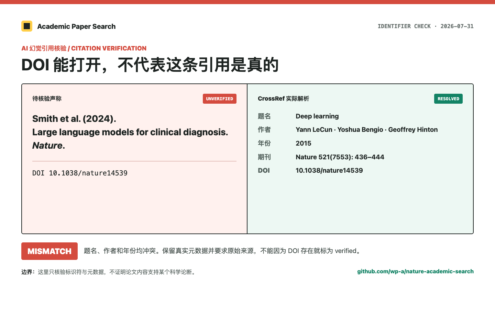
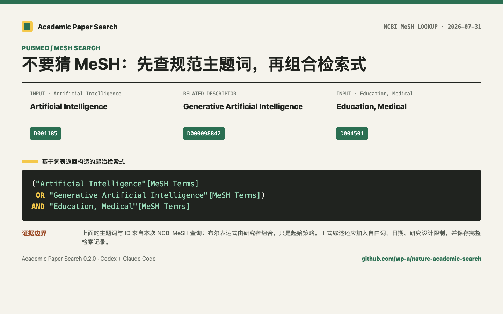
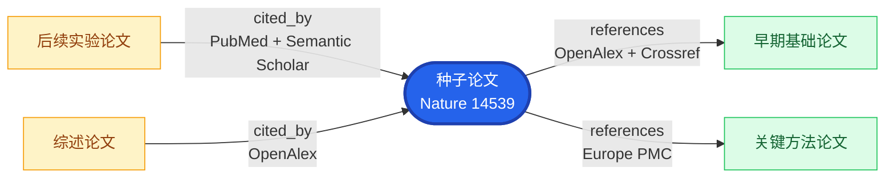

<div align="center">

# Academic Paper Search

**让 Codex / Claude Code 完成可复现的文献检索、核验与引用导出，并构建多源引文图谱。**

从一篇种子论文开始，检索 CrossRef、PubMed、arXiv、OpenAlex 和 Europe PMC，按强标识符去重，
逐字段核验引用，再沿参考文献和被引用关系扩展研究范围。

安装标识仍为 `nature-academic-search`，现有命令和配置无需迁移。

<sub>中文优先 · Codex + Claude Code 双兼容 · 五个默认论文源 · 可审计输出 · 有界引文图谱</sub>

[](https://github.com/wp-a/nature-academic-search/actions/workflows/ci.yml) [](https://pypi.org/project/nature-academic-search/) [](https://pypi.org/project/nature-academic-search/) [](LICENSE) [](https://github.com/wp-a/nature-academic-search/stargazers)

> **推荐配套服务 · [WPIRONMAN AI 中转](https://api.wpironman.top)**
>
> 为 Codex、Claude Code 和本项目 workflow 提供可选的 OpenAI-compatible 模型入口。
> **[进入控制台](https://api.wpironman.top)** · 中转不是论文来源、数据库或引用事实的替代品。

[30 秒开始](#30-秒开始) · [六个中文场景](#六个可复制的中文场景) · [能力矩阵](#能力矩阵) · [数据源](#数据源如何分工) · [边界](#能力边界)

</div>

## 先看它解决什么

| 你的问题 | 这个 skill 的回答 |
|---|---|
| “这篇论文到底存在吗？” | 用 DOI、PMID、PMCID、arXiv、OpenAlex 或 Semantic Scholar ID 解析原始元数据，再做字段级核验。 |
| “不同数据库的结果怎么合并？” | 优先按强标识符去重，保留 `sources`、`source_records` 和 `conflicts`，不静默覆盖冲突。 |
| “从一篇种子论文还能找到什么？” | 用 `get_paper_by_id(include_relations=true)` 获取有界的 references / cited_by 图谱。 |
| “AI 给的引用靠谱吗？” | 输出 `verified`、`mismatch`、`not_found` 或 `manual_needed`，不把题名相似当作事实。 |

核心流程是：**检索 → 去重 → 核验 → 导出**。需要引用关系时，在核验后增加
**引文图谱 → 人工判断**，而不是把引用次数当成证据质量。

## 30 秒开始

### Codex 插件

```bash
codex plugin marketplace add wp-a/nature-academic-search
codex plugin add nature-academic-search@wp-a-academic-tools
```

### Claude Code 插件

```bash
claude plugin marketplace add wp-a/nature-academic-search
claude plugin install nature-academic-search@wp-a-academic-tools
```

### CLI / 本地 MCP

```bash
uv tool install nature-academic-search
export PUBMED_EMAIL=researcher@example.com
nature-academic-search install --client both --email researcher@example.com
nature-academic-search preflight
```

也可以使用 `pipx install nature-academic-search`，或从源码安装：

```bash
git clone https://github.com/wp-a/nature-academic-search.git
cd nature-academic-search
bash install.sh researcher@example.com
```

> [!IMPORTANT]
> **安装后下一步：配置可选模型入口**
>
> 如果要启用 workflow 的计划或筛选辅助，可配置 WPIRONMAN AI 中转；不配置也能完成论文检索、核验和导出。
> 它只负责模型请求，不负责论文检索，不是论文来源。 [进入 WPIRONMAN 控制台 →](https://api.wpironman.top)

## 直接这样问

### 第一个请求

安装后直接对 Codex 或 Claude Code 说：

```text
使用 $nature-academic-search 查找 2022 年以来 GLP-1 受体激动剂与抑郁风险的论文。
使用默认五个论文源，按 DOI、PMID、PMCID、arXiv 和 OpenAlex ID 去重；逐源报告成功、失败和限流，
最后只把已核验记录导出为 RIS。
```

希望追踪一篇论文的上下游时：

```text
使用 $nature-academic-search 解析 DOI 10.1038/nature14539，打开 include_relations，
同时返回 references 和 cited_by，一跳即可；保留每条边的来源、方向和覆盖缺口，不把引用次数解释成证据质量。
```

## 六个可复制的中文场景

下面每个场景都可以直接复制到 Codex 或 Claude Code。前三个组成原来的“三个可复制的中文场景”，
并使用仓库中的真实结果截图；截图会标注 2026-07-31 的日期、版本和失败来源，不能被解读为所有数据库都成功。

### 三个真实结果入口

<table>
  <tr>
    <td align="center" width="33%">
      <a href="docs/examples/topic-scoping.md"></a><br>
      <sub><strong>开题检索</strong><br>多源发现与失败披露</sub>
    </td>
    <td align="center" width="33%">
      <a href="docs/examples/citation-verification.md"></a><br>
      <sub><strong>引用核验</strong><br>DOI 与元数据冲突</sub>
    </td>
    <td align="center" width="33%">
      <a href="docs/examples/pubmed-mesh.md"></a><br>
      <sub><strong>PubMed / MeSH</strong><br>主题词与检索式</sub>
    </td>
  </tr>
</table>

<sub>真实结果记录于 2026-07-31；每个案例都保留查询范围、工具版本和来源边界。</sub>

### 1. 开题检索：先扩大，再收窄

```text
使用 $nature-academic-search 为“生成式 AI 在医学教育中的应用与风险”做开题检索。
先记录检索日期、纳入范围和预印本政策，再用默认论文源检索；按 DOI、PMID、PMCID、arXiv 和 OpenAlex ID 去重。
把正式论文、预印本和未解决记录分开，逐源报告 sources_succeeded、sources_skipped 和 errors。
输出 10 条可继续核验的线索，并说明这不是系统综述，也不要根据引用次数判断证据质量。
```

预期得到：查询范围、去重前后数量、稳定 `record_id`、逐源状态和下一步核验清单。

本次真实结果与完整记录：[开题检索案例](docs/examples/topic-scoping.md)。

### 2. AI 幻觉引用核验：让 DOI 回到真实论文

```text
使用 $nature-academic-search 核验下面的参考文献。先解析 DOI / PMID / PMCID / arXiv ID，
再逐项比较题名、首位作者、年份、期刊和标识符。输出 verified、mismatch、not_found 或 manual_needed，
保留来源和冲突；不要根据题名相似、搜索摘要或 DOI 存在就自动判定为正确。

待核验引用：<在这里粘贴引用>
```

预期得到：字段级比较、冲突原因、原始来源 URL，以及需要人工确认的项目。

完整记录：[AI 幻觉引用核验案例](docs/examples/citation-verification.md)。

### 3. PubMed / MeSH 检索：先核词，再写检索式

```text
使用 $nature-academic-search 为“生成式 AI 与医学教育”构建 PubMed 起始检索式。
先分别调用 lookup_mesh 核对 Artificial Intelligence、Generative Artificial Intelligence 和 Education, Medical
的规范主题词与 MeSH ID；再把 MeSH 与题名/摘要自由词分组组合。输出每个主题词的核验结果、最终检索式和仍需人工调整的边界。
```

预期得到：规范主题词、MeSH ID、可审计的起始检索式，以及不能由工具替代的人工扩展项。

完整记录：[PubMed / MeSH 案例](docs/examples/pubmed-mesh.md)。

### 4. 上下游引文追踪：从一篇种子论文扩展

```text
使用 $nature-academic-search 解析 DOI 10.1038/nature14539，并打开 include_relations。
返回 relation=both、depth=1、rows=20；使用 OpenAlex、Crossref、PubMed、Europe PMC 和 Semantic Scholar 的可用关系。
输出 citation_graph 的 nodes、edges、observed_by、sources_skipped 和 errors；把 references 与 cited_by 分开解释，
不要把缺少 incoming 接口的来源写成“没有被引用”。
```

预期输出形如：

```json
{
  "seed_record_id": "publication:doi:10.1038/nature14539",
  "edges": [{"from": "publication:doi:...", "to": "publication:doi:...", "relation": "references", "observed_by": ["openalex"]}],
  "truncated": false,
  "sources_skipped": [],
  "errors": null
}
```

`depth=2` 必须显式请求；图谱是关系导航和审计数据，不是证据质量、因果性或影响力评分。

#### 图谱长什么样

下面是一个结构示意，不是固定的真实论文结果。蓝色是你查询的种子论文，绿色是它引用的论文，
黄色是后来引用它的论文。箭头始终表示 `citing → cited`：



读图时记住三点：

- `references` 表示当前论文引用了谁，例如 `S → R1`；
- `cited_by` 表示谁引用了当前论文，例如 `C1 → S`；
- `observed_by` 表示哪些数据库看到了同一条边，例如 `["openalex", "crossref"]`。

项目实际返回的是结构化 `citation_graph`，不是一张静态图片。少量节点可以转换成 Mermaid 放进
Markdown；中等规模适合生成可拖拽 HTML；更大的网络可以导出到 Gephi 或 Cytoscape。图谱只说明
论文之间的书目引用关系，不证明被引用论文支持某个结论，也不把引用次数当作证据质量。

### 5. 综述整理：检索、筛选、导出分开留痕

```text
使用 $nature-academic-search 为“数字疗法对抑郁症的随机对照试验”建立文献整理 workflow。
先生成 plan.json，等我批准后再检索；记录日期、数据库、纳入排除标准和预印本政策。
核验 DOI / PMID 后，把 verified 记录导出为 RIS，把 mismatch、not_found、manual_needed 和未解决冲突单独列出。
不要把初筛结果称为系统综述，也不要让模型替代双人筛选或偏倚评估。
```

预期产物：`plan.json`、`results.json`、`verification.json`、`screening.csv`、`references.ris`、`report.md`。

### 6. 临床试验关联：注册信息和论文分开核验

```text
使用 $nature-academic-search 查找正在招募的肺癌新辅助免疫治疗试验，
调用 search_papers(entity_type="trial")，按 NCT ID 去重并报告试验状态、干预和申办方。
如果记录包含 linked publication，再用 get_paper_by_id 单独核验 PMID / DOI；不要把 ClinicalTrials.gov 注册当成论文。
```

预期得到：独立的 trial 列表、NCT 标识符、linked publications 线索，以及分开的论文核验结果。

## 能力矩阵

| 能力 | 入口 | 典型输出 | 适合的科研动作 |
|---|---|---|---|
| 多源论文检索 | `search_papers` | `results`、`sources_queried`、`errors` | 开题、证据地图、主题发现 |
| 标识符与引用核验 | `get_paper_by_id` + `expected` | 字段级 `verified` / `mismatch` | 参考文献审计、AI 引用复核 |
| 上下游引文图谱 | `get_paper_by_id(include_relations=true)` | `citation_graph`、`edges` | 追踪经典工作、方法谱系和后续研究 |
| PubMed / MeSH 策略 | `lookup_mesh` | 主题词、MeSH ID | 构建可复查的 PubMed 起始式 |
| 格式化引用 | `get_citation` | APA、Nature、Vancouver 等 | 单条引用与稿件整理 |
| 声明式 workflow | CLI `workflow run` | `plan.json`、`run.json`、`graph.json` | 重复检索、审批和审计 |
| 批量导出 | CLI `citation` | RIS、BibTeX、NBIB、ENW | 交给 Zotero、EndNote 或文献管理器 |

四个 MCP 工具名保持稳定；引文图谱是 `get_paper_by_id` 的可选字段，不新增第五个工具。

### 统一过滤与可复现排序

`search_papers` 支持统一的 `filters`：`date_from`、`date_to`、`language`、`author`、
`document_type` 和 `identifiers`。传入 `ranking="relevance"` 会记录固定版本的
`ranking_score`、`ranking_reasons` 和 `score_version`；这些字段只描述检索相关性，不代表证据质量。

## WPIRONMAN AI 中转：可选模型层

WPIRONMAN 适合把 workflow 的研究计划、初筛规则或摘要级分类交给 OpenAI-compatible 模型；论文元数据和引用关系仍由本项目直连学术源。中转不提供 Crossref、PubMed、OpenAlex、Europe PMC 或 Semantic Scholar 的数据库覆盖，也不会让 DOI 自动变正确。

| 适合交给中转 | 不应交给中转 |
|---|---|
| 整理研究问题、生成 workflow plan、按已批准规则做摘要级初筛 | 判断 DOI 是否真实、补齐缺失引用、替代学术数据库、证明某篇论文支持某个结论 |
| 在允许的元数据范围内做结构化分类 | 上传全文或敏感材料，除非显式设置 `privacy.allow_full_text: true` |

```bash
export ACADEMIC_SEARCH_LLM_BASE_URL=https://api.wpironman.top/v1
export ACADEMIC_SEARCH_LLM_API_KEY=你的中转密钥
export ACADEMIC_SEARCH_LLM_MODEL=你的模型名
export ACADEMIC_SEARCH_LLM_PROTOCOL=responses_http
```

默认只发送标题、摘要、标识符和用户批准的元数据；全文只有在 workflow 中显式设置
`privacy.allow_full_text: true` 才会上传。密钥不会写入日志、manifest 或 prompt artifact。
网关不可用、超时或返回坏 JSON 时，模型步骤最多重试一次并标记为 `skipped`，检索、核验和导出继续。

中转控制台：[api.wpironman.top](https://api.wpironman.top)。论文源、引用关系和核验结果仍以本项目的直连数据为准。

## 数据源如何分工

| 来源 | 默认状态 | 最适合做什么 | 引文关系 | 边界 |
|---|---|---|---|---|
| CrossRef | 默认论文源 | DOI、出版商元数据、格式化引用 | `references` | 不是完整学科数据库；没有统一 incoming 接口 |
| PubMed | 默认论文源 | 生物医学索引、PMID、MeSH | `references` + `cited_by` | 不保证全文；受 NCBI 速率限制 |
| arXiv | 默认论文源 | 预印本和版本线索 | 不提供引用边 | 预印本不等于同行评审论文 |
| OpenAlex | 默认论文源 | 跨学科发现、开放获取和来源化引用指标 | `references` + `cited_by` | 指标只代表 OpenAlex 口径 |
| Europe PMC | 默认论文源 | PMID/PMCID、生物医学和开放全文线索 | `references` | 与 PubMed 重叠，主要提供 outgoing references |
| Semantic Scholar | 显式搜索、富化或图谱 | 补充元数据和引用关系 | `references` + `cited_by` | 需显式选择；受 API 配额影响 |
| ClinicalTrials.gov | `entity_type="trial"` | NCT 注册、状态、干预、申办方 | 不用于论文图谱 | 试验注册不是论文 |

省略 `sources` 时，publication 默认调用前五个论文源；显式传入 `sources` 时不会静默扩展。未连接
Google Scholar、Web of Science、Scopus、Embase、CNKI、万方，不会声称覆盖这些数据库。

第三方收录：[TensorBlock MCP Server Directory](https://tensorblock.co/mcp/servers/github-wp-a-nature-academic-search-24b4493d)。

## 输出与审计

每次检索保留 `search_run`：`run_id`、UTC 时间、请求来源、去重前后数量、过滤/排序参数和
`result_fingerprint`。每条记录有稳定 `record_id`，并保留来源 URL、冲突和来源化 `citation_counts`。

图谱输出包括：

- `nodes`：按强标识符合并的 publication 节点；
- `edges`：统一采用 citing → cited 方向，含 `relation` 和 `observed_by`；
- `sources_succeeded`、`sources_skipped`、`errors`：披露实际覆盖，缺少关系接口不等于零关系；
- `truncated`、`truncation_reason`、`depth_completed`：披露节点、边和深度预算。

保存完整 JSON 作为 `run.json` 或 `graph.json`，不要只截图标题列表。引用关系只描述导航结构，
不能替代原文阅读、同行评审判断、偏倚评估或因果推断。

## CLI 与深入文档

```bash
nature-academic-search --help
nature-academic-search serve
nature-academic-search preflight
nature-academic-search citation --pmid 28344011 --format ris
nature-academic-search citation --input refs.txt --format bib --output references/
nature-academic-search workflow run --file review.yml --output artifacts --approve
```

- [安装与配置](docs/installation.md)
- [检索工作流](references/search-workflows.md)
- [来源分层与边界](references/source-tiers.md)
- [引用文件格式](references/citation-files.md)
- [维护手册](docs/maintenance.md)

## 能力边界

- 本项目以元数据、标识符、引用关系和检索策略为核心，不承诺自动取得付费全文。
- 上游 API 可能限流、超时或暂时不可用；工具会保留成功结果并披露缺口。
- 引用次数属于来源特定指标，不相加为“全网总引用数”。
- 图谱边不代表证据质量、因果关系或论文结论支持。
- trial、preprint 和正式论文分开处理，不能只凭题名合并。
- 正式稿件提交前，仍需核对出版社页面、原文和期刊引用要求。

> `lookup_mesh` 的 ESummary 解析修复已包含在 PyPI `0.3.0` 与插件固定版本中。如果你的客户端仍显示旧版本，
> 请更新插件或从当前源码安装：
>
> ```bash
> git clone https://github.com/wp-a/nature-academic-search.git
> cd nature-academic-search
> bash install.sh --client both --email researcher@example.com
> ```

## 参与项目

发现解析、来源冲突或安装问题时，请提交 [Issue](https://github.com/wp-a/nature-academic-search/issues)。
贡献代码前请保留四个 MCP 工具名、实体边界和结果契约，并添加回归测试。

如果这个项目让你的文献检索更可追溯，欢迎点一个
[Star](https://github.com/wp-a/nature-academic-search)；它会帮助更多中文科研用户找到这套工作流。

## License

[MIT](LICENSE)
